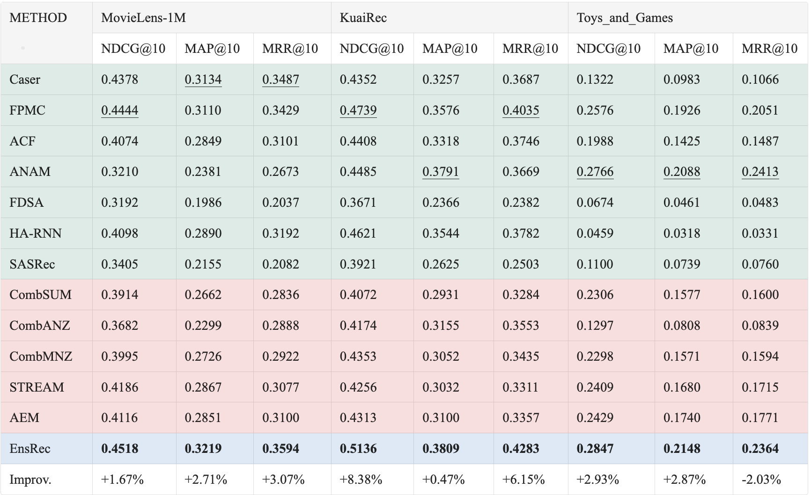

# 基于集成学习的个性化推荐算法设计

本项目为本科毕业设计，旨在通过实践巩固所学的推荐系统知识，并完成一个具有实际意义的应用或研究。


实验结果：



## 项目结构

```
.
├── basemodel    # 基模型部分实现
├── data         # 数据集
├── experiment   # 实验权重
│   ├── ablation  # 消融实验
│   └── hyperparameter_learning  # 超参数搜索实验
├── ipynb
├── llm_emb
│   ├── KuaiRec
│   ├── MovieLens-1M
│   └── Toys_and_Games
├── Readme.md
├── requirements.txt
└── src  # EnsRec模型实现
    ├── ckpt
    ├── config.yaml
    ├── data.py
    ├── datasets
    ├── infer.ipynb
    ├── main.py
    ├── model
    └── module
```

## 安装与运行

### 准备环境

- 克隆项目到本地：

```bash
git clone https://github.com/NoyeArk/graduation_design.git
```

- 安装依赖：

```bash
pip install -r requirements.txt
```

### 准备数据集

本文使用的数据集为三个：MovieLens-1M、KuaiRec 和 Toys_and_Games，可以从[链接](https://pan.baidu.com/s/1ZgtYXfAwQELQcPSiYVkm_Q?pwd=d4a2)进行下载。也可以直接下载处理好的数据格式：[链接](https://pan.baidu.com/s/1lJTwDEFEw7JF6MXErxHaNA?pwd=ihs7)进行下载。

每个数据集由三个文件构成：

1. `interaction.csv`：包含用户-物品的交互
2. `user.csv`（未使用）：每个用户的描述信息
3. `item.csv`：每个物品的描述信息

### 计算基模型推荐结果

修改 `basemodel/config.yaml` 配置文件中的 `name` 字段为要运行的基模型 `[acf, anam, caser, fdsa, harnn, pfmc, sasrec]`。配置文件中的 `dataset` 下的 `path` 字段修改为要训练的数据集。

```bash
cd basemodel
python main.py
```

### 运行EnsRec模型

```bash
cd src
python main.py config.yaml
```
